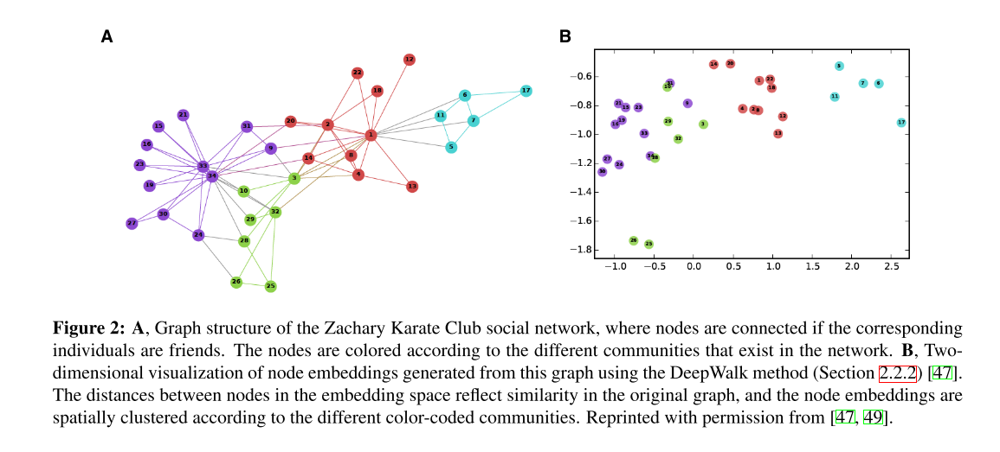
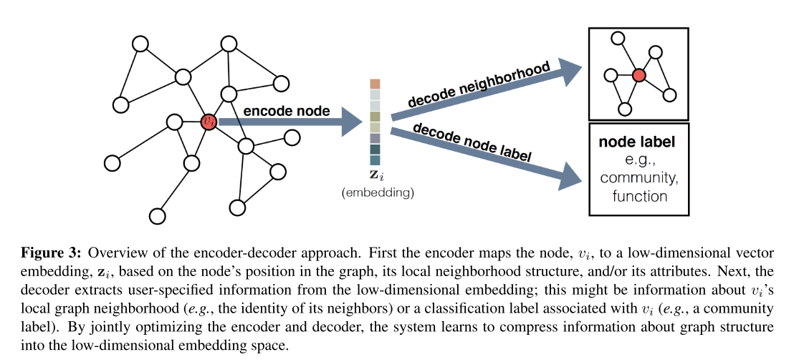
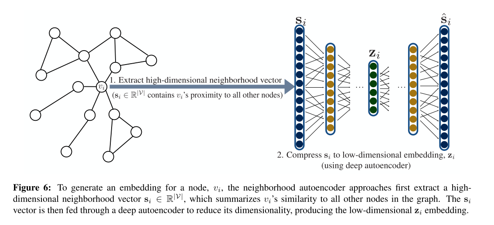

```{r setup, include=FALSE}
options(htmltools.dir.version = FALSE)
```

```{r xaringan-themer, include=FALSE, warning=FALSE}
library(xaringanthemer)
style_duo_accent(
  primary_color = "#133354",
  secondary_color = "#133354",
  inverse_header_color = "#FFFFFF"
)
```

```{r xaringan-tile-view, echo=FALSE}
xaringanExtra::use_tile_view()
```

```{r xaringan-panelset, echo=FALSE}
xaringanExtra::use_panelset()
```

# Abstract

1. ML on graphs con aplicaciones desde redes sociales al diseño de fármacos. 
2. *Desafío primario: encontrar una manera de representar, o codificar, la estructura de un grafo para que la información sea aprovechada (exploited) en un modelo de ML.*
3. En general, el aprendizaje automático 


---

# 1. Introduction

* Many machine learning applications seek to make predictions or discover new patterns using graph-structured data as feature information.
* The central problem in machine learning on graphs is finding a way to incorporate information about graph-structure into a machine learning model. 
* The challenge— from a machine learning perspective—is that there is no straightforward way to encode this high-dimensional, non-Euclidean information about graph structure into a feature vector.
* More recently, there has been a surge of approaches that seek to learn representations that encode structural information about the graph. The idea behind these representation learning approaches is to learn a mapping that embeds nodes, or entire (sub)graphs, as points in a low-dimensional vector space Rd. The goal is to optimize this mapping so that geometric relationships in the embedding space reflect the structure of the original graph.

---

* Previous work treated this problem as a pre-processing step, using hand-engineered statistics to extract structural information. In contrast, **representation learning approaches treat this problem as machine learning task itself, using a data-driven approach to learn embeddings that encode graph structure.**

* Our survey attempts to **merge together multiple**, disparate lines of research that have drawn significant attention across different subfields and venues in recent years—e.g., *node embedding methods*, which are a popular object of study in the data mining community, and *graph convolutional networks*, which have drawn considerable attention in major machine learning venues. In doing so, **we develop a unified conceptual framework for describing the various approaches and emphasize major conceptual distinctions.**

---

# Assumptions


---

# Embedding nodes

#### The goal is to encode nodes as low-dimensional vectors that summarize their graph position and the structure of their local graph neighborhood.
#### These low- dimensional embeddings can be viewed as encoding, or projecting, nodes into a latent space, where geometric relations in this latent space correspond to interactions (e.g., edges) in the original graph.

```{r echo=FALSE, out.width = '90%', fig.align='center'}

```

---

### Overview of approaches: encoder-decoder perspective

* In this framework, we organize the various methods around two key mapping functions: **an encoder**, which maps each node to a low-dimensional vector, or embedding, and **a decoder**, which decodes structural information about the graph from the learned embeddings.

#### The intuition behind the encoder-decoder idea is the following: if we can learn to decode high-dimensional graph information—such as the global positions of nodes in the graph or the structure of local graph neighborhoods—from encoded low-dimensional embeddings, then, in principle, these embeddings should contain all information necessary for downstream machine learning tasks.

---
```{r echo=FALSE, out.width = '100%', fig.align='center'}

```

**Once we have optimized the encoder-decoder system, we can use the trained encoder to generate embeddings for nodes, which can then be used as a feature inputs for downstream machine learning tasks.** For example, one could feed the learned embeddings to a logistic regression classifier to predict the community that a node belongs to [47], or one could use distances between the embeddings to recommend friendship links in a social network

---

### Methodological components

1. A pairwise similarity function sG : V ×V → R+, defined over the graph G. This function measures the similarity between nodes in G.
2. An encoder function, ENC, that generates the node embeddings. This function contains a number of trainable parameters that are optimized during the training phase.
3. A decoder function, DEC, which reconstructs pairwise similarity values from the generated embeddings. This function usually contains no trainable parameters.
4. A loss function, ?, which determines how the quality of the pairwise reconstructions is evaluated in order to train the model, i.e., how DEC(zi, zj) is compared to the true sG(vi, vj) values.

---

## Shallow-embedding approach

The majority of node embedding algorithms rely on what we call shallow embedding. For these shallow em- bedding approaches, the encoder function—which maps nodes to vector embeddings—is simply an “embedding lookup”:
$ENC(vi) = Zvi$
where $Z$ ∈ $Rd×|V|$ is a matrix containing the embedding vectors for all nodes and $vi$ ∈ IV is a one-hot indicator vector indicating the column of $Z$ corresponding to node $vi$. 


---

## Shallow embedding approaches

* **Factorization-based approaches**

1.  Laplacian eigenmaps
2.  Inner-product methods

--
* **Random walk approaches**

1. DeepWalk and node2vec
2. Large-scale information network embeddings (LINE)


---

### Major drawbacks of shallow embedding approaches

1. **No parameters are shared between nodes in the encoder** (i.e., the encoder is simply an embedding lookup based on arbitrary node ids). This can be statistically inefficient, since parameter sharing can act as a powerful *form of regularization*, and it is also computationally inefficient, since it means that the number of parameters in shallow embedding methods necessarily grows as $O(|V|)$.
2. **Shallow embedding also fails to leverage node attributes during encoding**. In many large graphs nodes have attribute information (e.g., user profiles on a social network) that is often highly informative with respect to the node’s position and role in the graph.
3. **Shallow embedding methods are inherently transductive**, i.e., they can only generate embeddings for nodes that were present during the training phase, and they cannot generate embeddings for previously unseen nodes unless additional rounds of optimization are performed to optimize the embeddings for these nodes. This is highly problematic for evolving graphs, massive graphs that cannot be fully stored in memory, or domains that require generalizing to new graphs after training.

---

## Generalized encoder-decoder architectures

* **Neighborhood autoencoder methods**

1. Deep Neural Graph Representations (DNGR)
2. Structural Deep Network embeddings (SDNE)

--

* **Neighborhood aggregation & convolutional encoders**

---

## Neighborhood autoencoder methods

The basic idea behind these approaches is that they use autoencoders—a well known approach for deep learning in order to compress information about a node’s local neighborhood. DNGR and SDNE also differ from the previously reviewed approaches in that they use a *unary decoder* instead of a pairwise one.

--

```{r echo=FALSE, out.width = '100%', fig.align='center'}

```


---


  
  
