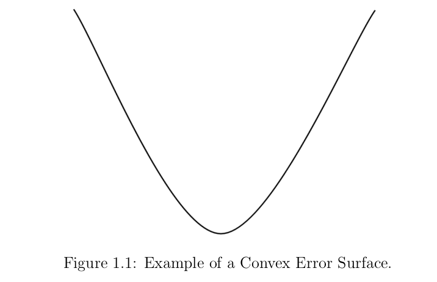
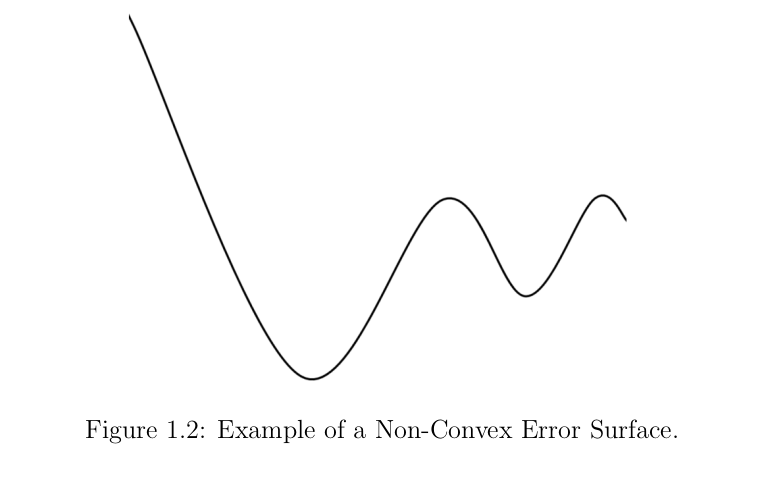
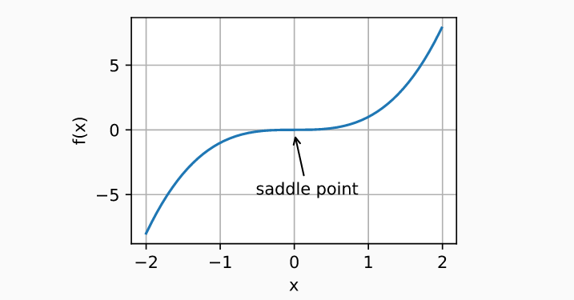

---
output:
  xaringan::moon_reader:
    lib_dir: libs
    css: xaringan-themer.css
    nature:
      highlightStyle: github
      highlightLines: true
      countIncrementalSlides: false
---

```{r setup, include=FALSE}
options(htmltools.dir.version = FALSE)
```

```{r xaringan-themer, include=FALSE, warning=FALSE}
library(xaringanthemer)
style_duo_accent(
  primary_color = "#133354",
  secondary_color = "#133354",
  inverse_header_color = "#FFFFFF"
)
```

```{r xaringan-tile-view, echo=FALSE}
xaringanExtra::use_tile_view()
xaringanExtra::use_animate_css()
```

```{r xaringan-panelset, echo=FALSE}
xaringanExtra::use_panelset()
```

```{r xaringan-tachyons, echo=FALSE}
xaringanExtra::use_tachyons()
```


background-image: url(img/diapo1.jpg)
background-size: cover
class: inverse,  middle


## Optimization in Neural Networks
### Machine Learning Sessions 
#### Roxana Noelia Villafañe

fecha: `r Sys.Date()`

---
# Outline


* Generalities 
* Model Capacity 
* 


---
class: animated slideInRight fadeOutLeft


# Introduction 

* The goals of optimization and deep learning are fundamentally different. The former is primarily concerned with minimizing an objective whereas the latter is concerned with finding a suitable model.

* Training error and generalization error generally differ: since the objective function of the optimization algorithm is usually a loss function based on the training dataset, the goal of optimization is to reduce the training error. However, the goal of statistical inference (and thus of deep learning) is to reduce the generalization error.


---
class: animated slideInRight fadeOutLeft


* A neural network model uses the examples to learn how to map specific sets of input variables to the output variable. It must do this in such a way that this mapping works well for the training dataset, but also works well on new examples not seen by the model during training. This ability to work well on specific examples and new examples is called the ability of the model to generalize.


* A multilayer perceptron is just a mathematical function mapping some set of input
values to output values.

---
class: animated slideInRight fadeOutLeft

### When talking about optimization in the context of neural networks, we are discussing non-convex optimization.

*Convex optimization* involves a function in which there is only one optimum, corresponding to the global optimum (maximum or minimum). There is no concept of local optima for convex optimization problems, making them relatively easy to solve — these are common introductory topics in undergraduate and graduate optimization classes.

*Non-convex optimization* involves a function which has multiple optima, only one of which is the global optima. Depending on the loss surface, it can be very difficult to locate the global optima.


---
class: animated slideInRight fadeOutLeft

.panelset[
.panel[.panel-name[Convex functions]

```{r echo=FALSE, out.width = '65%', fig.align='center'}

```
]

.panel[.panel-name[Non convex functions]

```{r echo=FALSE, out.width = '70%', fig.align='center'}

```
]

.panel[.panel-name[Saddle points]

A flat region or saddle point is a point on the landscape where the gradient is zero. 
```{r echo=FALSE, out.width = '70%', fig.align='center'}

```
]
]


---
class: animated slideInRight fadeOutLeft


# Navigating the Non-Convex Error Surface

* A change to the model weights will result in a change to the model error.

* The settling of the optimization process on a solution is referred to as **convergence**, as
the process has converged on a solution.

* This is a search or an optimization process and we refer to optimization algorithms that
operate in this way as gradient optimization algorithms, as they naively follow along the error gradient. The algorithm that is most commonly used to navigate the error surface is called **stochastic gradient descent**, or SGD for short.

* Stochastic Gradient Descent is more efficient as it uses the gradient information specifically to update the model weights via an algorithm called **backpropagation**.


---
class: animated slideInRight fadeOutLeft

* Backpropagation refers to a technique from calculus to calculate the derivative of the model error for specific model parameters, allowing model weights to be updated to move down the gradient.

## Components of the learning algorithm 

Training a deep learning neural network model using stochastic gradient descent with backpropagation involves choosing a number of components and hyperparameters, they are:

* Network Topology.
* Loss Function.
* Weight Initialization.
* Batch Size.
* Learning Rate.
* Epochs.
* Data Preparation.

---
class: animated slideInRight fadeOutLeft

# Network Topology

* The capacity of a neural network defines the scope of the mapping functions that the model can approximate. 
* A larger capacity means that the model is more flexible, but harder to train as it has many more parameters that have to be learned and provides a more challenging optimization problem to solve. 
* The number of nodes in the hidden layer define the capacity, and a network with a single hidden layer with a sufficient number of nodes can approximate any mapping function (so-called universal approximation). 


.bg-lightest-blue.b--dark-blue.ba.bw2.br3.shadow-5.ph4.mt5[
Network topology is the number of nodes (or equivalent) in the hidden layers and the
number of hidden layers in the network.

]
---
class: animated slideInRight fadeOutLeft

# Loss Function

An error function must be chosen, often called the objective function, cost function, or the loss function. Typically, a specific probabilistic framework for inference is chosen called Maximum Likelihood. Under this framework, the commonly chosen loss functions are cross-entropy for
classification problems and mean squared error for regression problems.


.bg-lightest-blue.b--dark-blue.ba.bw2.br3.shadow-5.ph4.mt5[
Loss Function is the function used to measure the performance of a model with a specific
set of weights on examples from the training dataset

]

---
class: animated slideInRight fadeOutLeft


# Weigth initialization

The search or optimization process requires a starting point from which to begin model
updates. The starting point is defined by the initial model parameters or weights. Because
the error surface is non-convex, the optimization algorithm is sensitive to the initial starting point. As such, small random values are chosen as the initial model weights, although different techniques can be used to select the scale and distribution of these values. These techniques are referred to as weight initialization methods. This can be tied to the choice of activation function.


.bg-lightest-blue.b--dark-blue.ba.bw2.br3.shadow-5.ph4.mt5[
Weight initialization is the procedure by which the initial small random values are
assigned to model weights at the beginning of the training process.


]

---
class: animated slideInRight fadeOutLeft

# Batch size

When updating the model, a number of examples from the training dataset must be used to
calculate the model error, often referred to simply as loss. All examples in the training dataset may be used, which may be appropriate for smaller datasets. Alternately, a single example may be used which may be appropriate for problems where examples are streamed or where the data changes often. A hybrid approach may be used where the number of examples from the training dataset may be chosen and used to used to estimate the error gradient. The choice of the number of examples is referred to as the batch size.


.bg-lightest-blue.b--dark-blue.ba.bw2.br3.shadow-5.ph4.mt5[
Batch Size is the number of examples used to estimate the error gradient before updating
the model parameters.

]


---
class: animated slideInRight fadeOutLeft


# Learning Rate

* Once an error gradient has been estimated, the derivative of the activation function can be calculated and used to update each parameter. There may be statistical noise in the training dataset and in the estimate of the error gradient. Also, the depth of the model (number of layers) and the fact that model parameters are updated separately means that it is hard to calculate exactly how much to change each model parameter to best way to move the whole model down the error surface. 

* Instead, a small portion of the update to the weights is performed each iteration. A hyperparameter called the learning rate controls how much to update model weights and, in turn, controls how fast a model learns on the training dataset.

.bg-lightest-blue.b--dark-blue.ba.bw2.br3.shadow-5.ph4.mt5[
Learning Rate is the amount that each model parameter is updated per iteration of the
learning algorithm.

]


---
class: animated slideInRight fadeOutLeft


# Epochs

* The training process must be repeated many times until a good or good enough set of
model parameters is discovered. The total number of iterations of the process is bounded by
the number of complete passes through the training dataset after which the training process
is terminated. This is referred to as the number of training epochs. This hyperparameter is
tightly related to both the choice of learning rate and batch size and can be set to a large value and almost ignored when using some regularization methods.

.bg-lightest-blue.b--dark-blue.ba.bw2.br3.shadow-5.ph4.mt5[
Epochs is the number of complete passes through the training dataset before the training
process is terminated.

]


---
class: animated slideInRight fadeOutLeft, inverse,  middle


# Model Capacity 
---

class: animated slideInRight fadeOutLeft

# Model Capacity & Network Topology

* Neural networks learn mapping functions. The capacity of a network refers to the range or scope of the functions that the model can approximate.

* Informally, a model’s capacity is its ability to fit a wide variety of functions.

* A model with less capacity may not be able to sufficiently learn the training dataset. A
model with more capacity can model more different functions and may be able to learn a
function to sufficiently map inputs to outputs in the training dataset. Whereas a model with too much capacity may memorize the training dataset and fail to generalize or get lost or stuck in the search for a suitable mapping function. Generally, we can think of model capacity as a control over whether the model is likely to underfit or overfit a training dataset.

**We can control whether a model is more likely to overfit or underfit by altering its
capacity.**


---
class: animated slideInRight fadeOutLeft


The capacity of a neural network can be controlled by two aspects of the model:
* Number of Nodes.
* Number of Layers.


A model with more nodes or more layers has a greater capacity and, in turn, is potentially
capable of navigating a larger set of mapping functions.


---


---
# Bibliography

  